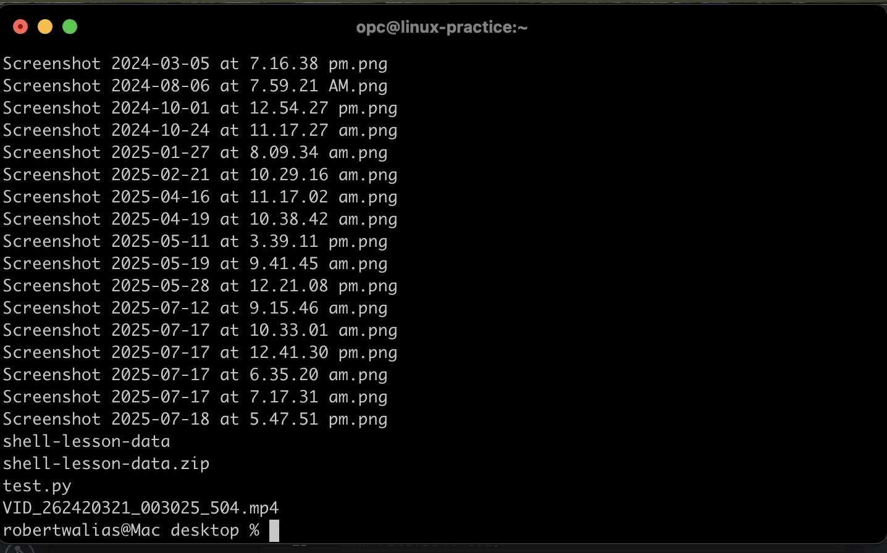

# Week 3 - Security Lab 1: FileVault Encryption

## Objective
Enable and verify FileVault full-disk encryption on macOS.

## Commands Used

## Commands Used
```bash
fdesetup status
diskutil apfs list

## Screenshots
```
### FileVault GUI)


