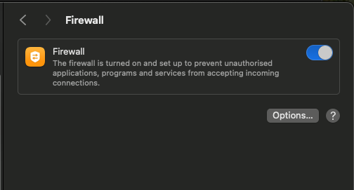

# Week 3 - Security Lab 2: macOS Firewall Configuration

## Objective
Enable and verify the macOS application firewall.

## Commands Used
```bash
sudo /usr/libexec/ApplicationFirewall/socketfilterfw --getglobalstate

## Screenshots
```
### Firewall GUI


#I Really like this tool!!

## Its the Best!!
