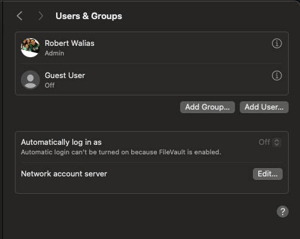

# Lab 1: User Accounts & Permissions

## Objective
Explore how macOS manages users and groups using both CLI tools and System Settings GUI.

---

## Part 1: Current User Info

```bash
whoami
id
groups

## Part 4: GUI Comparison

Used the System Settings to inspect user account type (Admin vs. Standard), full name, and login options.

### Screenshot
``` 


