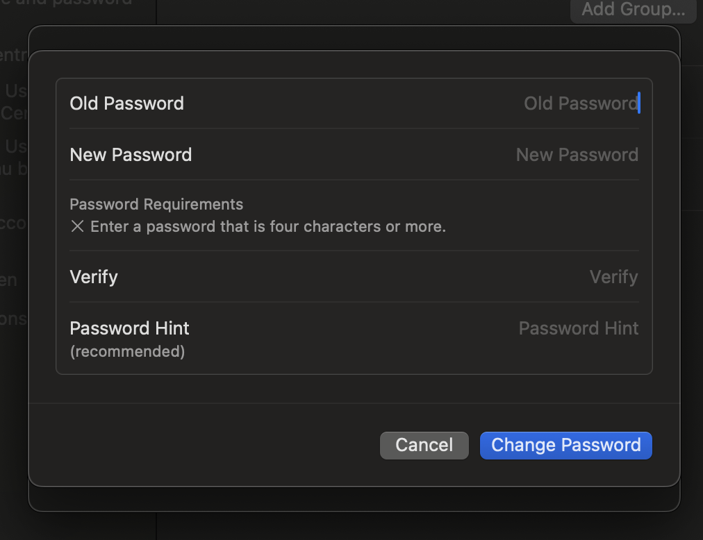

# Lab 2: Password Policies & Expiration

## Objective
Explore how password settings are managed in macOS and understand password policy best practices for securing local user accounts.

---

## Part 1: Manual Password Change (CLI)

Command used:

```bash
passwd

###Screenshot
```

