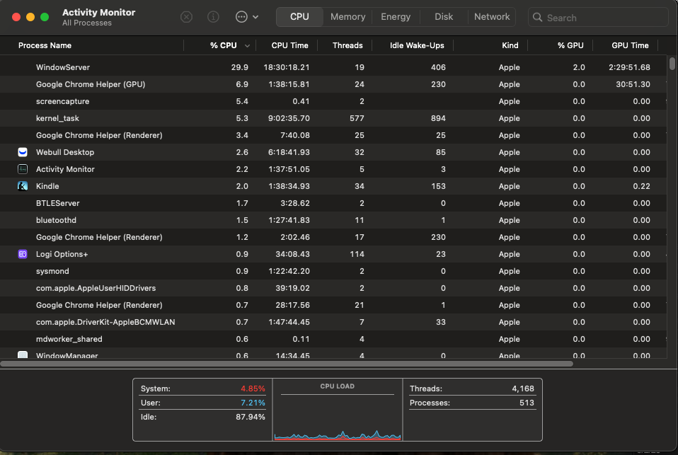

# Lab 4: Security Tools Survey

## Objective
Explore common macOS tools for monitoring active processes, open files, system resource usage, and investigating potential security threats.

---

## Part 1: Process Monitoring (CLI)

### Tools:
```bash
top
ps aux

### Screenshot:
```


---

## Summary

- **CLI tools** like `top`, `ps aux`, and `lsof` provide powerful insights into what's happening on a system
- `sudo lsof -i` is useful for identifying active network connections and checking for unauthorized listeners
- **Activity Monitor** offers a visual overview of CPU, memory, disk, and network usage, useful for spotting suspicious or resource-intensive processes
- Familiarity with these tools is essential for detecting unusual behavior, troubleshooting performance, and securing endpoints

